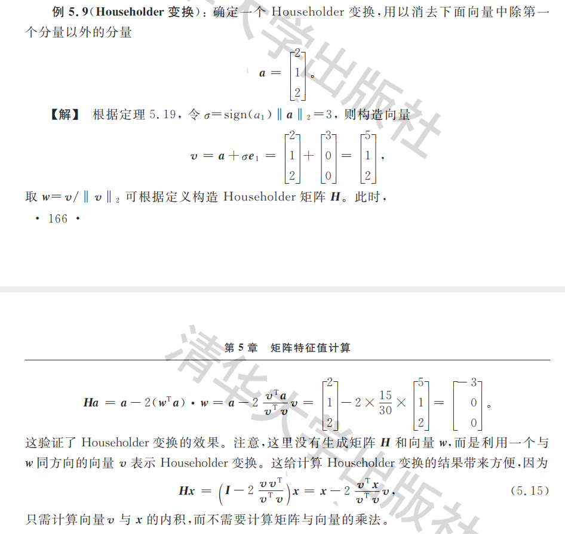

# Chap5

## 基本概念与特征值分布额

### 基本概念和性质

#### 相关概念

> 定义5.1：对于矩阵$A = (a_{kj}\in C^{n \times n})$，于是称
> $$
> \varphi{(\lambda)} = det(\lambda I - A) = \lambda^n + c_a\lambda^{n-1} +...+c_n 
> $$
> 为A的特征多项式；$\varphi(x)=0$为A的特征方程；他的根被称为特征值；$\lambda(A)$表示A的全体特征值集合，也成为特征值谱；
>
> 除此之外满足$(\lambda I - A)x = 0$的解向量x为特征向量；则有$Ax = \lambda x$；
>
> 同一个特征值可能对应多个特征向量，从而构成特征子空间；

> 定义5.2：特征值是特征方程的几重根 $\to$ 代数重数；每个特征值的特征子空间的位数 $\to$ 几何重数；

> 定义5.3：如果矩阵$A \in R^{n \times n}$的某个代数重数为k的特征值对应的线性无关特征向量数目少于k，则称A为亏损矩阵；否则为非亏损矩阵；

#### 相关定理

> 定义5.1：设$\lambda_{j}$为n阶矩阵A的特征值，则有：
>
> - $\sum_{j=1}^{n}\lambda_j = \sum_{j=1}^na_{jj}=tr(A)$；
> - $\Pi_{j=1}^{n}\lambda_j = det(A)$；

> 定理5.2：矩阵转置不改变特征值；

> 定理5.3：若矩阵A为对角矩阵或上下三角阵，则其对角线元素即矩阵的特征值；

> 定理5.4：若矩阵A为分块对角矩阵，或分块上下三角阵，其中每个分块阵均为方阵，则矩阵A的特征值为各对角块矩阵特征值的合并，（这里面的合并指的是集合取并集）；

> 定理5.5：矩阵的相似变换不改变特征值。设矩阵A和B为相似矩阵，那么存在非奇异矩阵X使得$B = X^{-1}AX$则有：
>
> - 相似变换不改变特征值；
> - 若y为B的特征向量，则相应地Xy为A的特征向量；

> 定理5.6：设矩阵$A \in R^{n \times n}$的m个不同特征值；
>
> - 所有特征值的代数重数和为n；
> - 所有特征值的几何重数都不大于代数重数；
> - 不同特征值的特征向量线性无关；所有特征子空间的基线性无关；
> - 若每个特征值的代数重数等于几何重数，则总共可以得n个线性无关的特征向量，是全空间$C^n$的基；

> 定理5.7：矩阵$A \in R^{n \times n}$可对角化的充分必要条件是A为非亏损矩阵。若A可以对角化，那么触怒在非奇异矩阵$X \in C^{n \times n}$使得
> $$
> X^{-1}AX = \Lambda
> $$
> 其中$\Lambda$为对角矩阵，则$\Lambda$的对角元素，则$\Lambda$的对角元素为矩阵$A$的特征值，而矩阵$X$的列向量为n个线性无关的特征向量；（这个分解也被称为特征值分解）

> 定理5.8：设矩阵$A \in R^{n \times n}$，存在非奇异矩阵$X \in C^{n \times n}$使得
> $$
> A = XJX^{-1}
> $$
> 矩阵J为分块对角矩阵（称为约当标准型）；

> 定理5.9：n阶矩阵特征值的性质：
>
> - $cA$的特征值为$c\lambda_i$；
> - $A+cI$的特征值为$\lambda_i + c$；
> - $A^k$的特征值为$\lambda_i^{k}$；
> - $f(A)$的特征值为$f(\lambda_i)$；$f(x)$为多项式；
> - 若A为非奇异矩阵，则没有零特征值，所以$A^{-1}$的特征值为$\lambda_i^{-1}$；

### 特征值分布范围的估计

#### 相关定义

> 定义5.4：设$A=(a_{kj}) \in C^{n \times n}$，记$r_k = \sum_{j=1,j\ne k}^{n}|a_{kj}|$，则集合$D_k = \{z: | z-a_{kk}|\le r_k,z\in C\}$在复平面内以$a_{kk}$为圆心、$r_k$为半径的圆盘，称为A的Gerschgorin圆盘；

#### 相关定理

> **定理5.10**（圆盘定理）：设$A = (a_{kj}) \in C^{n \times n}$，则有：
>
> - A的每一个特征值都属于A的Gerschgorin圆盘中，即对任一特征值$\lambda$，必定存在k使得：$|\lambda - a_{kk}| \le \sum_{j=1,j\ne k}^{n}|a_{kj}|$；
> - 若A的Gerschgorin圆盘中有m个圆盘组成一连通并集S，且S与余下的n-m个圆盘分离，则S内恰好包含A的m个特征值；

## 幂法和反幂法

### 幂法

#### 相关定义

> 定义5.5：在矩阵A的特征值中，模最大的特征值称为主特征值，也成为第一特征值，对应的特征向量为主特征向量；
>
> 主特征值不一定唯一；

> 定义5.6：记$\overline{max}(v)$为向量$v\in R^n$的绝对值最大的分量，也就是$\overline(v)=v_j，|v_j|=\max_{1 \le k \le n}|v_k|$；若不唯一，则取$j$最小的哪一个，称$u = \frac{v}{\overline{max}(c)}$为规格化后的向量；（注意这里面的向量为列向量，后面满足无穷范数为1的时候，也就是最大行和为1，则这时候$\overline{max}=1$）

#### 相关定理

> **定理5.12**（幂法计算特征值）：设$A \in R^{n \times n}$，其主特征值唯一，设为$\lambda_1$；随机选择一个非零向量$v_0\in R^n$按照迭代公式进行计算：
> $$
> v_k = A v_{k-1}
> $$
>
> 1. 若$k \to \infty$时，$v_k$趋近于$\lambda_1$的特征向量；
> 2. $\lim_{k\to \infty}\frac{(v_{k+1})_j}{(v_k)_j}=\lambda_1$；其中$(v_k)_j$表示的是$v_k$的最大元素；
>
> 注意：在计算的时候：
>
> - 如果$|\lambda_1|>1$，实际计算的时候$v_k$可能会出上溢出；
> - 如果$|\lambda_1|<1$，实际计算的时候$v_k$可能回出现下溢出；
>
> 也可能出现收敛速度很慢的情况；需要规格化向量防止溢出；

> 定理5.13：根据规格化定义得出下面两条性质：
>
> - 设u为规格化向量，则$||u||_{\infty}=1$，并且$\overline{max}(u) = 1$；
> - 设向量$v_1$和$v_2$规格化之后变成了$u_1$和$u_2$，如果有$v_1 = \alpha v_2,\alpha\ne 0$，则$u_1=u_2$；

> 定理5.14：设$A \in R^{n \times n}$，其著特征值唯一，极为$\lambda_1$，随机取一非零初始向量$v_0$，设$u_0=v_0$，可以推导出来如下关系：
> $$
> v_k = Au_{k-1} = \frac{A^kv_0}{\overline{max}(A^{k-1}v_0)} \\
> u_k = \frac{A^kv_0}{\overline{max}(A^kv_0))}
> $$
> 推导就有
> $$
> \lim_{k \to \infty}v_k = \lambda_1 \frac{x_1}{\overline{max}(x_1)} \\
> \lim_{k \to \infty} \overline{max}(v_k) = \lambda_1
> $$

### 加快收敛的方法

#### 原点位移技术

已知矩阵$A$的主特征值为$\lambda_1$，根据矩阵$A$的特征值分布找到一个p使得$B = A- pI$的主特征值为$\lambda_1-p$；这样就能使得
$$
|\frac{\lambda_2(B)}{\lambda_1-p}| < |\frac{\lambda_2(A)}{\lambda_1}|
$$
其中$\lambda_2$是表示的是第二大的特征值；

#### 瑞利商加速

> 定义5.7：设$A \in R^{n \times n}$，且为对称矩阵，对任一非零向量$x \ne 0$，则称
> $$
> R(x) = \frac{<Ax, x>}{<x,x>}
> $$
> 为对应于向量$x$的瑞利商，这里面$<,>$表示向量内积；

> 定理5.15：设$A \in R^{n \times n}$，且为对称矩阵，其n个特征值以此为$\lambda_1 \ge \lambda_2 \ge ... \ge \lambda_n$，则矩阵A有关的瑞利商的上下确界为$\lambda_1$和$\lambda_n$，即对于$\forall x \ne 0$：
> $$
> \lambda_n \le R(x) \le \lambda_1
> $$
> 且x为$\lambda_1$对应的特征向量时，$R(x)=\lambda_1$，当x为$\lambda_n$对应的特征向量时，$R(x)=\lambda_n$；

> 定理5.16：设A为实对称矩阵，且主特征值唯一，极为$\lambda_1$，应用幂法，则规格化向量$u_k$的瑞利商满足
> $$
> R(u_k) = \frac{<Au_k,u_k>}{<u_k,u_k>}=\lambda_1 + O((\frac{\lambda_2}{\lambda_1})^{2k})
> $$
> 其中，$\lambda_2$为第二大特征值；

经过计算发现直计算误差为$(\frac{\lambda_2}{\lambda_1})^{(k-1)}$，所以在每次迭代之前计算瑞利商，能够更快的逼近$\lambda_1$；这里面计算不是针对向量进行改变带入之后的迭代，而是对于计算结果进行处理，能够更好的得到结果；

### 反幂法

利用矩阵$A^{-1}$的特征值是$A$的倒数，计算最小特征值；

## 矩阵的正交三角化

### Householder变换

#### 相关定义

> 定义5.8：设向量$\omega \in R^{n}$且$\omega^T\omega=1$，称矩阵
> $$
> H(\omega) = 1 - 2\omega\omega^T
> $$
> 为Householder矩阵，或初等反色矩阵；
>
> 有性质：$H(\omega) = H(-\omega)$；

#### 相关定理

> 定理5.17：设H为Householder矩阵，则有性质：
>
> - 矩阵H为对称矩阵；
> - 矩阵H为正交矩阵；
> - Householder变换实现向量在线性空间中的"镜面反射"，即$Hx$是向量x相对于法向为$\omega$的平面的镜像；

> 定理5.18：设$x,y\in R^n,x\ne y,||x||_2 = ||y||_2$，则存在Householder矩阵H使得$Hx = y$；（用几何意义理解）

> 定义5.19：设$x = [x_1, ..., x_n]^T \ne 0$，则存在Householder矩阵H，使得$Hx = -\sigma e_1$，其中，
> $$
> \sigma = sign(x_1)||x||_2, e_1 = [1,0,...,0]^T,sign(x_1)=x_1的符号函数
> $$

这有一个例题，可以参考一下实现方法；这里面计算v是找到一个平行于$\omega$的向量，因为目标向量$\vec{r}=-\sigma \vec{e_1}$

所以这样就可以归一化得到结果；

### Gives旋转变换

> 定义5.9：矩阵$G \in R^{2\times 2}$
> $$
> \left(
> \begin{matrix}
> cos\theta & sin\theta \\
> -sin\theta & cos\theta
> \end{matrix}
> \right)
> $$
> 称矩阵G为2阶Givens旋转矩阵；这回将一个向量顺时针旋转$\theta$角度；